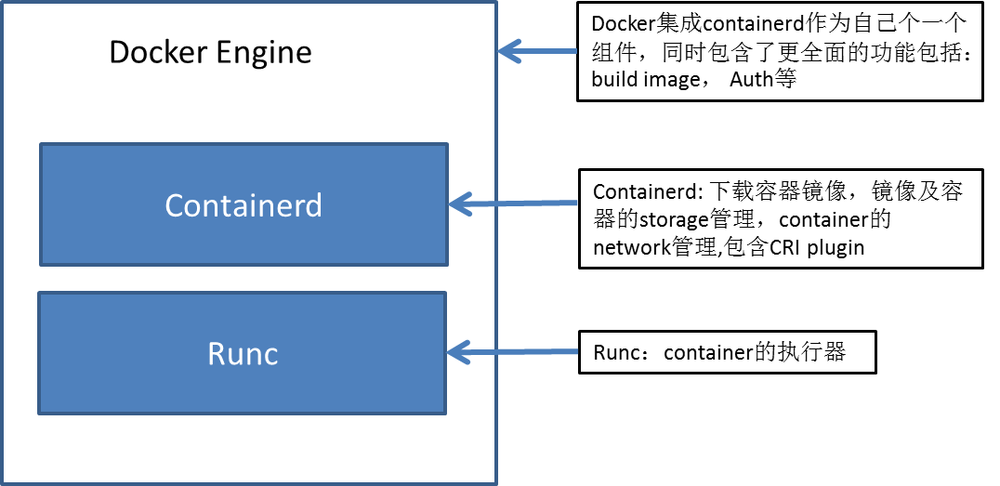

# Docker engine

Download URL: https://download.docker.com/linux/

The docker has several components integrated together to serve as an engine. 

#### Note: now docker engine don't support cgroup v2, so we can't disable cgroup v1.

## 1. Instllation
download the docker-ce package and install via dpkg command
```
dpkg -i <docker-ce deb package>
```

## 2. configure docker.service

Modify `ExecStart=` to `ExecStart=/usr/bin/dockerd`, since all configurations are moved to `/etc/docker/daemon.json`
and add `Slice=container.slice` in `[Service]` section.

example docker.service file can be found [here](./docker.srvice)


modify `MountFlags=shared` to adhere to the `CSI` to let kubernetes use CSI storages.

## 3. configure docker parameter via `/etc/docker/daemon.json`
```json
{
    "debug": true,
    "exec-opts": ["native.cgroupdriver=systemd"],
    "cgroup-parent": "container.slice",
    "hosts": ["tcp://0.0.0.0:2375","unix:///var/run/docker.sock"],
    "ip": "0.0.0.0",
    "log-driver": "journald",
    "log-opts":  {"tag":"docker_{{.Name}}_{{.ID}}"},
    "metrics-addr" : "0.0.0.0:9323",
    "experimental" : true,
    "insecure-registries" : [""]
}
```
3.1 storage driver 
For backend storage driver, default docker engine use aufs/overlay2, for enterprise usage, docker recommand use devicemapper with direct-lvm, if use fresh installation, we can directly set direct-lvm with following parameter:

3.1.1 auto-configure direct-lvm,managed automatically by docker engine daemon, just add following conf to `/etc/docker/daemon.json`

```json
  "storage-driver": "devicemapper",
  "storage-opts": [
    "dm.directlvm_device=/dev/sdb",
    "dm.thinp_percent=95",
    "dm.thinp_metapercent=1",
    "dm.thinp_autoextend_threshold=80",
    "dm.thinp_autoextend_percent=20",
    "dm.directlvm_device_force=false"
  ]
```
3.1.2 Manually direct-lvm
if we need to configure it manually, following steps are required
- Install proper requied dependencies
    - RHEL / CentOS: device-mapper-persistent-data, lvm2, and all dependencies
    - Ubuntu / Debian: thin-provisioning-tools, lvm2, and all dependencies

- Create pv 
    ```shell
    pvcreate /dev/sdb
    ```

- Create lvm group
    ```shell
    vgcreate docker /dev/sdb
    ```

- Create two logical volumes named `thinpool` and `thinpoolmeta`,The last parameter specifies the amount of free space to allow for automatic expanding of the data or metadata if space runs low, as a temporary stop-gap. These are the recommended values.
    ```shell
    lvcreate --wipesignatures y -n thinpool docker -l 95%VG
    lvcreate --wipesignatures y -n thinpoolmeta docker -l 1%VG
    ```

- Convert the volumes to thinpool and a storage location for metadata for the thinpool. using `lvconvert` command
    ```shell
    lvconvert -y --zero n -c 512K --thinpool docker/thinpool   --poolmetadata docker/thinpoolmeta
    ```

- Configure autoextension of thinpool via an `lvm` profile
    ```shell
    cat > /etc/lvm/profile/docker-thinpool.profile <<-EOF
    activation {
    thin_pool_autoextend_threshold=80
    thin_pool_autoextend_percent=20
    }
    EOF
    ```
- Apply the LVM profile 
    ```shell
    lvchange --metadataprofile docker-thinpool docker/thinpool
    ```
- Enable monitoring for logical volumes on your host. Without this step, automatic extension does not occur even in the presence of the LVM profile.
    ```shell
    lvs -o+seg_monitor
    ```

- add following configure to `/etc/docker/daemon.json`
    ```json
    {
        "storage-driver": "devicemapper",
        "storage-opts": [
        "dm.thinpooldev=/dev/mapper/docker-thinpool",
        "dm.use_deferred_removal=true",
        "dm.use_deferred_deletion=true"
        ]
    }    
    ```

- for complete guide to configure `lvm-direct`, refer to http://docs.docker.com/storage/storagedriver/device-mapper-driver

3.1.3 we can still use [zfs](https://docs.docker.com/storage/storagedriver/zfs-driver/) and [btrfs](https://docs.docker.com/storage/storagedriver/btrfs-driver/) as storage driver.


## 4. Create certificates

This step can be optional.

4.1 Create `docker-ca-csr.json`
```json

{
    "CN": "Kubernetes docker CA",
    "hosts": [
    ],
    "key": {
        "algo": "rsa",
        "size": 4096
    },
    "names": [
        {
            "C": "CN",
            "ST": "SC",
            "L": "Chengdu",
            "O": "lmy.com .ltd",
            "OU": "DevOps"
        }
    ],
     "ca": {
    "expiry": "262800h"
     }
}
```

4.2 Generate the docker CA
```shell
cfssl genkey -initca docker-ca-csr.json | cfssljson -bare docker-ca
```

4.3 Create docker-ca-config.json, which contains profiles of server/client.
```json
{
  "signing": {
    "default": {
      "expiry": "8760h"
    },
    "profiles": {
      "server": {
        "usages": [
          "signing",
          "key encipherment",
          "server auth"
        ],
        "expiry": "35040h"
      },
      "client": {
        "usages": [
          "signing",
          "key encipherment",
          "client auth"
        ],
        "expiry": "35040h"
      }
    }
  }
}
```

4.4 Create docker-server-csr.json, add the ip list(the node's all IP addresses that docker engine is runing on) to the `hosts`,
```json
{
    "CN": "docker-server",
    "hosts": [
      "192.168.59.201",
      "192.168.59.202",
      "192.168.59.203",
      "127.0.0.1",
    ],
    "key": {
      "algo": "rsa",
      "size": 4096
    },
    "names": [
              {
                  "C": "CN",
                  "ST": "SC",
                  "L": "Chengdu",
                  "O": "lmy.com .ltd",
                  "OU": "DevOps"
              }
    ]
  }
```
4.5 Create docker-server cert 
```shell
cfssl gencert -ca=docker-ca -ca-key=docker-ca-key.pem -config=docker-ca-config.json -profile=server docker-server-csr.json | cfssljson -bare docker-server
```

4.6 Create docker-client-csr.json
```json
{
    "CN": "docker-client",
    "key": {
      "algo": "rsa",
      "size": 4096
    },
    "names": [
              {
                  "C": "CN",
                  "ST": "SC",
                  "L": "Chengdu",
                  "O": "lmy.com .ltd",
                  "OU": "DevOps"
              }
    ]
  }
```

4.7 Create docker-client cert
```
cfssl gencert -ca=docker-ca -ca-key=docker-ca-key.pem -config=docker-ca-config.json -profile=client docker-client-csr.json | cfssljson -bare docker-client
```