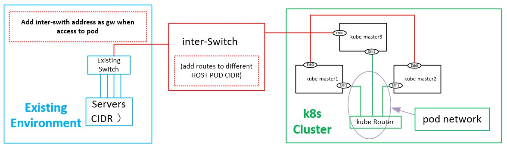

# Networking

All network plugins are list on https://kubernetes.io/docs/concepts/cluster-administration/networking.

When we are about to create a kubernetes cluster, one thing need to consider is if we need to integrated with existing infrastructure in the environment, that is if pods can be accessible by existing network directly.

## Network Type

1. layer 2 (switching)
    - vlan

2. layer 3 (routing) solution
    - BGP (Calico,Contiv)

3. Overlay solutions
    - VXLAN (flannel,cilium,ovs)

4. Underlay solutions:
    - MACVLAN
    - IPVLAN

If the number of  pods running in k8s cluster is small, we can use L2  network same vlan/Vlan groups. This is only applicable in small network.

Generally when we choose network for kubernetes, we perfer `Overlay(VXLAN)` or `routing(calico)`. to achieve the access to pod IP address ,  kubernetes cluster should be setup in the a dedicated network and connected with existing network with a `inter-switch`, on this `inter-swtich` add routes to the different host pod CIDR, and on the network environment, add IP address of `inter-switch` as gateway to the POD network, as show in following diagram. The prequisite is the pod network is a unique subnet and will not overlap with others, that is we can't use multitenancy.

## Network Deployment

Three network plugins are chosed in this deployment:
1. [cilium](./cilium/index.md)
2. [calico](./calico/index.md)
3. [kube-router](./kube-router/index.md)

## Network policy

Network policy is to enforce security to the cluster, so we can add it to the cluster

1. [Network Policy](network-policy.md)